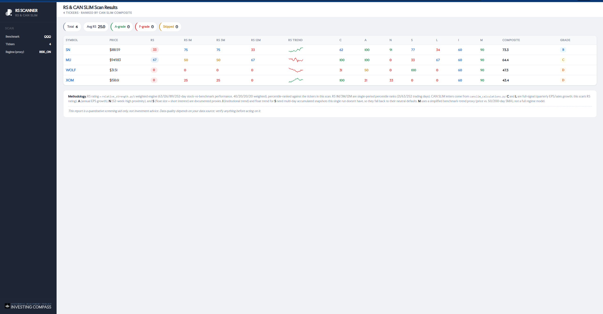

# RS & CAN SLIM Standalone Scanner

!(example_report_close_up.png)




> A standalone stock screener that computes Relative Strength ratings and CAN SLIM grades, generating a self-contained HTML report -  Investing Compass .

## Overview

This tool takes a list of ticker symbols, fetches price and fundamental data, and produces a comprehensive stock analysis report featuring:

- **RS Rating** – Weighted relative strength (63/126/189/252-day periods, 40/20/20/20 weighted)
- **RS Sparkline** – 30-day RS ratio trend visualization
- **CAN SLIM Grades** – Individual letter grades (C·A·N·S·L·I·M) plus composite score and A–F band
- **Sortable HTML Report** – Click column headers to sort by any metric

## Quick Start

### Installation

```bash
pip install yfinance pandas numpy
```


> **Note:** `yfinance` is lazily imported – use `--demo` mode to preview without installing yfinance.

### Basic Usage

```bash
# Scan a list of tickers
python rs_canslim_scanner.py AAPL MSFT NVDA GOOGL AMZN

# Load tickers from a file (one per line, or comma/space separated)
python rs_canslim_scanner.py --file tickers.txt

# Custom benchmark and output path
python rs_canslim_scanner.py AAPL MSFT --benchmark QQQ -o my_report.html

# Preview with synthetic data (no yfinance required)
python rs_canslim_scanner.py --demo
```

Open the generated `.html` file in any browser. Click any numeric column header to sort.

## What It Computes

### Relative Strength (RS)
- **Weighted RS Rating** – Stock vs. benchmark performance over 63/126/189/252 trading days, weighted 40/20/20/20
- **RS 1M/3M/12M** – Single-period percentile ranks (21/63/252 trading days)
- **RS Sparkline** – 30-day RS ratio trend

### CAN SLIM Grades
- **C** – Current quarterly earnings + sales growth (full signal)
- **A** – Annual EPS growth (proxy; yfinance annual data)
- **N** – New highs (52-week-high proximity proxy)
- **S** – Supply/demand (float size + short interest proxy)
- **L** – Leader/laggard (RS rating, full signal)
- **I** – Institutional sponsorship (trend + ownership proxy)
- **M** – Market direction (benchmark trend proxy)

> **Note:** Several letters use documented proxies where full pipeline data is unavailable. The "Methodology" panel in the report explains signal quality per letter.

## Command Line Options

| Option | Description |
|--------|-------------|
| `tickers` | Space-separated ticker symbols |
| `-f, --file` | Path to a file containing tickers (one per line, or comma/space separated) |
| `-b, --benchmark` | Benchmark symbol (default: SPY) |
| `-o, --output` | Output HTML file path (default: rs_canslim_report.html) |
| `--demo` | Use synthetic data – no yfinance required |

## File Structure

| File | Purpose |
|------|---------|
| `rs_canslim_scanner.py` | **Main driver** – fetch data, run calculations, render HTML |
| `relative_strength.py` | RS calculation engine (weighted performance + percentile ranking) |
| `rs_sparkline.py` | 30-day RS ratio sparkline calculator |
| `canslim_calculations.py` | CAN SLIM letter grading (C·A·N·S·L·I·M + composite) |
| `investing_compass_logo_footer.svg` | Logo embedded in report sidebar |
| `example_report.html` | Sample output from `--demo` mode |

## Example Report

The generated HTML includes:

- **Sidebar** – Benchmark, ticker count, regime verdict, logo
- **Stats row** – Total tickers, average RS, A-grade count, F-grade count
- **Sortable table** – All metrics with color-coded values
- **RS sparklines** – Visual trend indicators
- **Methodology panel** – Transparency on data quality and proxies

## License

This project is licensed under a **custom non-commercial license**:

- ✅ Personal, private, non-commercial use only
- ❌ No commercial use, distribution, or modification for public distribution

See the `LICENSE` file for full terms.

**Copyright © 2026 Pearl__Code (keos.ignite.digital@gmail.com)**

## Disclaimer

**This is a quantitative screening aid only, not investment advice.** Data quality depends on your data source. Always verify information before making investment decisions.

---

Built with ❤️ for the investing community.
```
